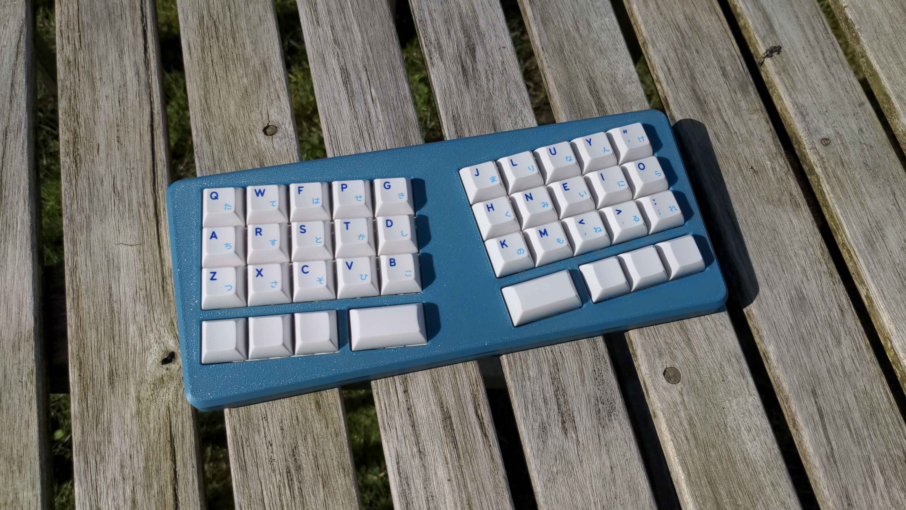

### oschi

a orthogonal le chiffre-esk keyboard with hummingbird style alpha options

## Features

- MX-Hotswap sockets
- CH552T Controller (w/ FAK firmware)
- gerber and case files are supplied (kicad files, stl as well as cadquery files)
- completely open source, permissive license ([CERN-OHL-P](https://cern-ohl.web.cern.ch/home))

##### layout options

make sure to grab the right combinations of plate and case top.

## Want one?

All production files you need to build your own board can be found [here](./prod/).

Apart from the pcb and optionally a case you need:

- 38 hotswap sockets

- 38 diodes (1N4148 int SOT-123)

- 38 of your favourite switches

- 1x CH552T (TSSOP-20)

- 1x USBLC6-2SC6 (SOT-23-6)

- 1x 10kOhm resistor (SMD 0603)

- 2x 5.1kOhm resistors (SMD 0603)

- 2x 100nF capacitors (SMD 0603)

- 1x USB Connector C-Type, 12 pin/16pin

### firmware

Config for FAK can be found [here](https://github.com/weteor/fak-config/tree/main/keyboards/oschi). Please also see [FAK-Firmware site](https://github.com/semickolon/fak) for more information

Bootloader should be available on plugin until firmware is written. After that either use the firmware BOOT to go into bootloader, or hold the boot button on the pcb pressed while pluggin in the usb cable.

### the rest

Everything in this repository is free to use however you might see fit. If you want to support me and my projects, please consider linking back to this repository if you build/change/use anything.

If you would like to send me a tip, you could do it [here](https://ko-fi.com/weteor) (Please don't feel like you have to).

### more pictures

---

